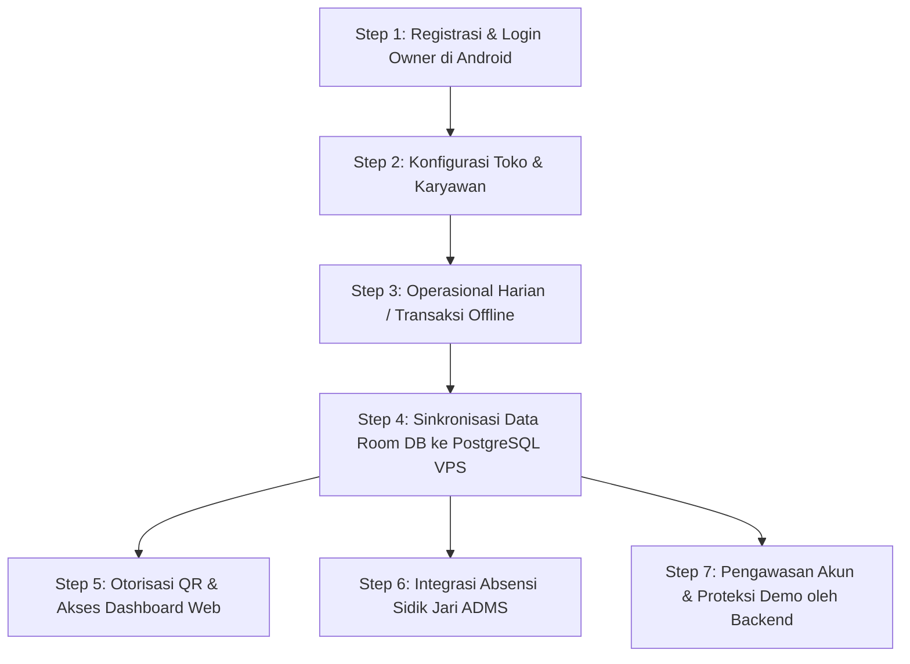

# Skema Sistem & Alur Kerja Aplikasi POSBah (Step-by-Step)

Dokumen ini menjelaskan arsitektur, komponen, skema database, serta alur proses step-by-step dari aplikasi **POSBah (Versi 2.0.0)** yang meliputi **Frontend Web, Backend Server (Golang), Database (Room & PostgreSQL VPS), Client Android (APK)**, serta infrastruktur **Server VPS**.

---

## 1. Komponen Utama Arsitektur

### A. Android Client (APK) - *Offline-First*
* **Teknologi**: Native Kotlin, Jetpack Compose, Dagger Hilt untuk Dependency Injection, dan MVVM (Model-View-ViewModel) Architecture.
* **Keamanan**: 
  * `DeviceIntegrityGuard` untuk mendeteksi Root, Emulator, Frida, dan Magisk.
  * `FLAG_SECURE` diaktifkan untuk mencegah screenshot di seluruh halaman.
  * Penyimpanan aman menggunakan Android Keystore dan `EncryptedSharedPreferences` (AES-256 GCM).
  * PBKDF2-HMAC-SHA256 untuk hashing PIN karyawan dengan unique salt.
* **Fungsi**: UI kasir, manajemen produk, klien, invoice, arus kas, pembayaran, data karyawan, absensi, dan pengaturan outlet.

### B. Database (Dual Layer)
* **Local DB (Android)**: **Room Database + SQLCipher**. Database terenkripsi secara lokal *at-rest* menggunakan passphrase 32-byte unik per perangkat yang diamankan di Android Keystore.
* **Cloud DB (Server)**: **PostgreSQL yang dihosting secara lokal di VPS**. 
  * *Hasil Investigasi*: Backend Go menggunakan PostgreSQL yang berjalan langsung di VPS (`localhost:5432` dengan database `posbah`) untuk penyimpanan utama data cloud. Pengecekan data (seperti row count audit) dilakukan langsung di VPS menggunakan perintah `psql`.
  * *Catatan Supabase*: Walaupun pada awalnya sistem menggunakan Supabase Cloud (pada era backend Node.js `server.js`), di arsitektur baru berbasis Golang ini database telah dimigrasikan ke PostgreSQL lokal di VPS demi efisiensi dan kontrol penuh.
* **Sync Pipeline**: **`SupabaseSyncManager`** dan **`WebSocketSyncClient`** di sisi Android.
  * *Catatan Nama*: Nama kelas di Android tetap menggunakan kata `Supabase` (untuk kompatibilitas/warisan kode lama), namun alamat jaringan (`VPS_URL`) telah diubah ke domain VPS (`https://www.zedmz.cloud`). Android melakukan request HTTP/WS ke VPS, dan VPS yang akan memasukkan data ke PostgreSQL lokal.

### C. Backend API Server (Golang)
* **Teknologi**: Go (Golang) compiled binary, menggunakan routing net/http standar bawaan Go untuk performa tinggi dan efisiensi RAM di VPS.
* **Fitur Utama**:
  * **Cron Worker Background**: Berjalan di Goroutine setiap jam untuk memproses audit lockout akun demo (otomatis menonaktifkan akun demo > 2 hari, dan menghapus data demo > 5 hari).
  * **WebSocket Server (`/ws`)**: Untuk sinkronisasi real-time dan notifikasi.
  * **ADMS Fingerprint Server**: Endpoint `/iclock/cdata` dan `/iclock/getrequest` untuk mengintegrasikan mesin absensi sidik jari fisik secara langsung ke database.
  * **QR Authentication Middleware**: Mengelola session ID untuk otorisasi login web dari aplikasi Android.
  * **File Handler**: Manajemen upload logo tenant, tanda tangan pengirim (`ttd-pengirim`), serta penyajian static files (termasuk halaman admin dan QR receiver).

### D. Frontend (Web Dashboard & Admin Portal)
* **Teknologi**: Vanilla HTML, CSS, JavaScript (`app.js`, `style.css`), qrcodejs.
* **Halaman Web**:
  * `/` (Landing Page & Customer/Client Invoice Sign): Tempat klien melihat detail invoice digital dan melakukan tanda tangan penerima secara online (`signature_receiver_web.html`).
  * `/admin`: Portal khusus Administrator POSBah untuk memantau pengguna demo/premium, verifikasi pembayaran manual, memblokir tenant, memantau log sistem, serta mengontrol distribusi rilis APK.

### E. Server VPS & Deployment
* **Infrastruktur**: Ubuntu Server LTS.
* **Proses Manager**: **PM2** (Node/NPM helper) atau Systemd Service untuk menjalankan binary Golang `posbah-backend` secara background (auto-restart saat crash/reboot).
* **Web Server & Reverse Proxy**: **Nginx** sebagai pintu gerbang masuk (`posbah_nginx.conf`), menangani sertifikat SSL (HTTPS & WSS) serta mem-ward request ke port internal backend (port 3000).

---

## 2. Struktur Skema Database Relasional (Room & PostgreSQL VPS)

Secara garis besar data dikelompokkan berdasarkan `tenantId` untuk mengisolasi data antar pengguna (Multi-Tenant).

### A. Tabel Utama di PostgreSQL Server (VPS)
1. **`local_users`**: Menyimpan data user pemilik (Owner) akun POSBah beserta status premium, tanggal daftar, dan versi APK yang aktif.
2. **`tenants`**: Detail badan usaha/toko utama yang memiliki relasi ke satu atau lebih outlet.
3. **`outlets`**: Data cabang-cabang toko di bawah tenant.
4. **`employees`**: Data karyawan (kasir/admin) lengkap dengan `pinHash`, `role` (KASIR, ADMIN, OWNER), gaji (`salary`), dan data verifikasi email.
5. **`bmp_clients`**: Data klien B2B pembeli invoice, nominal saldo titipan, serta tanda tangan digital penerima.
6. **`bmp_invoices`**: Data transaksi invoice/tagihan manufaktur, nomor tagihan, status bayar (`DRAFT`, `SENT`, `PAID`, `OVERDUE`), total nominal, dan jalur file tanda tangan penerima.
7. **`bmp_products`**: Produk spesifik yang terkait dengan invoice.
8. **`bmp_master_products`**: Basis data master item produk (beserta reject rate, berat, unit, dan gambar).
9. **`bmp_invoice_payments`**: Log pembayaran invoice per termin.
10. **`bmp_cashflow`**: Log arus kas masuk/keluar dari kas operasional maupun pembayaran otomatis invoice.
11. **`bmp_settings`**: Pengaturan pabrik/manufaktur (biaya listrik bulanan, jumlah mesin, gaji harian, hari kerja sebulan, harga karung, dll).
12. **`bmp_employees`**: Data karyawan pabrik manufaktur.
13. **`bmp_payrolls`**: Histori pembayaran gaji karyawan berdasarkan kehadiran.
14. **`bmp_bahan_baku`** & **`bmp_bahan_baku_item`**: Pembelian bahan baku dan item-item penyusunnya.
15. **`print_settings`**: Konfigurasi template cetak struk/surat jalan/invoice per tenant (logoPath, ttd, nama bank, dll).
16. **`products`**: Data produk untuk POS/kasir retail.
17. **`customers`**: Data pelanggan POS.
18. **`transactions`** & **`transaction_items`**: Log transaksi penjualan POS retail beserta item yang dibeli.
19. **`activity_logs`**: Catatan aktivitas user untuk audit trail.
20. **`bmp_adms_devices`** & **`bmp_attendance_logs`**: Log sidik jari dan perangkat mesin absensi fisik ADMS.

### B. Entitas & Data yang Disimpan Secara Lokal di Room SQLCipher (Android)
Database Room lokal berfungsi sebagai media penyimpanan utama saat perangkat sedang *offline*. SQLCipher memastikan seluruh data berikut terenkripsi secara aman *at-rest*:

1. **Owner & Tenant Account (`LocalUser` & `Tenant`)**:
   - Informasi profil pemilik (email, nama, foto profil).
   - Detail tenant aktif yang dipegang oleh perangkat.
2. **Struktur Toko (`Outlet`)**:
   - Daftar cabang/outlet yang dikelola, status buka/tutup outlet, dan alamat cabang.
3. **Data Staff (`Employee`)**:
   - Informasi kasir/admin toko beserta hash PIN mereka (`pinHash`) untuk verifikasi login lokal saat offline.
4. **Modul Manajemen Klien B2B (`BmpClientEntity`)**:
   - Nama klien, nomor telepon, alamat, NPWP/Nomor Pajak, saldo titipan, serta tanda tangan digital penerima.
5. **Manajemen Invoice BMP (`BmpInvoiceEntity` & `BmpProductEntity`)**:
   - Dokumen tagihan (nomor invoice, tanggal jatuh tempo, status pembayaran, catatan, total nilai).
   - Item produk kustom yang dibeli dalam invoice tersebut (kuantitas, harga, unit, dll).
6. **Master Produk Manufaktur (`BmpMasterProductEntity`)**:
   - Kamus produk master (jenis bahan baku, reject rate, cycle time produksi, berat per gram, kapasitas cavity cetakan, unit, harga default, dan gambar produk).
7. **Arus Keuangan (`BmpInvoicePaymentEntity` & `BmpCashFlowEntity`)**:
   - Riwayat pembayaran invoice termin (jumlah bayar, tanggal bayar, metode transfer/kas).
   - Buku kas operasional masuk dan keluar (tanggal, deskripsi, nominal, referensi transaksi).
8. **Operasional & Penggajian Pabrik (`BmpSettingsEntity`, `BmpEmployeeEntity`, & `BmpPayrollEntity`)**:
   - Konfigurasi biaya pabrik (biaya listrik bulanan, gaji harian standar, hari kerja sebulan, dll).
   - Data pekerja pabrik (PIN mesin absensi sidik jari, jabatan, nominal gaji).
   - Rekap penggajian pekerja pabrik (`BmpPayrollEntity`).
9. **Pembelian Bahan Baku (`BmpBahanBakuEntity` & `BmpBahanBakuItemEntity`)**:
   - Catatan pembelian bahan baku (nomor tagihan supplier, total harga, foto nota lokal, dan detail berat/kuantitas bahan baku per item).
10. **Pengaturan Cetak (`PrintSettingsEntity`)**:
    - Konfigurasi Bluetooth thermal printer, opsi cetak logo, alignment header struk, template struk (modern/klasik), informasi rekening bank untuk transfer, dan path gambar logo lokal.
11. **Modul Retail POS (`ProductEntity`, `CustomerEntity`, `TransactionEntity`, & `TransactionItemEntity`)**:
    - Master barang toko retail (harga beli/jual, stok lokal, kategori, barcode barang, varian produk, harga grosir).
    - Data customer retail (nama, nomor telepon, alamat).
    - Log penjualan kasir (nomor struk, total belanja, diskon, nominal bayar, uang kembalian, tanggal transaksi) beserta detail barang terjual.
12. **Sistem Internal (`ActivityLogEntity`, `BmpProductStockEntity`, `BmpStockLedgerEntity`, & `BmpProductionLogEntity`)**:
    - Log audit aktivitas pengguna lokal.
    - Status stok barang dan kartu stok pergerakan keluar-masuk barang secara real-time.
    - Log produksi mesin (jumlah produk dicetak, produk reject, dan waktu mesin berjalan).

---

## 3. Urutan Alur Kerja Step-by-Step Aplikasi (Ecosystem Lifecycle)

Berikut adalah urutan alur jalannya sistem dari pendaftaran awal hingga operasional harian:

### **Step 1: Pendaftaran dan Autentikasi Pengguna Utama (Owner)**
1. User membuka aplikasi **Android POSBah**.
2. Sistem melakukan pengecekan integritas perangkat (`DeviceIntegrityGuard`). Jika aman, dilanjutkan ke layar Login.
3. Owner melakukan login menggunakan **Google Sign-In** (via Credential Manager).
4. Aplikasi memproses JWT token di sisi Android, mengirim data registrasi baru jika email belum terdaftar, lalu membuat UUID `tenantId` baru.
5. SQLite (Room + SQLCipher) lokal di-inisialisasi dengan passphrase 32-byte unik per perangkat, yang disimpan di Android Keystore.
6. Data user baru dikirim melalui API Golang ke database PostgreSQL di VPS.

### **Step 2: Konfigurasi Toko & Karyawan**
1. Di dalam aplikasi Android, Owner mengisi profil bisnis, menambahkan outlet pertama, dan melengkapi data cetak di menu pengaturan.
2. Owner mendaftarkan data karyawan (seperti kasir) beserta PIN login mereka.
3. Sisi Android mengenkripsi PIN dengan algoritma PBKDF2-HMAC-SHA256 (120.000 iterasi + random salt).
4. Data karyawan yang telah ter-hash dikirim ke backend server untuk disimpan di PostgreSQL VPS. Backend akan mengirimkan email konfirmasi login/password secara aman kepada karyawan tersebut.

### **Step 3: Operasional Bisnis Harian (Offline-First)**
1. Karyawan login ke aplikasi Android menggunakan PIN masing-masing (validasi hash instan secara lokal).
2. Karyawan melakukan transaksi, seperti menambahkan klien, membuat Invoice BMP, menambahkan daftar barang belanjaan, dan memasukkan kas masuk/keluar.
3. Seluruh data transaksi ini disimpan langsung ke dalam tabel Room Database (`SQLCipher`) lokal di perangkat Android. 
4. Transaksi dapat berjalan lancar tanpa terganggu walaupun koneksi internet lambat atau terputus sama sekali. Data baru ditandai dengan flag `isSynced = false`.

### **Step 4: Sinkronisasi Data Room DB ke PostgreSQL VPS**
1. Saat Android mendeteksi koneksi internet aktif, `SupabaseSyncManager` berjalan secara background.
2. **Push Flow**: Android memindai data lokal yang memiliki flag `isSynced = false`. Data ini dibungkus ke dalam JSON array dan dikirim ke endpoint `/api/sync/` di Golang Backend, lalu dimasukkan ke database PostgreSQL di VPS. Jika berhasil, status lokal diubah menjadi `isSynced = true`.
3. **Pull Flow**: Android membandingkan timestamp `lastUpdated` miliknya dengan server VPS. Jika server memiliki data yang lebih baru (misal ada perubahan dari dashboard web), Android mengunduh data tersebut dan memperbarui Room DB lokal.
4. **WebSocket Sync**: Jika aplikasi menyala, koneksi WebSocket (`/ws`) tetap terjaga untuk sinkronisasi instan dua arah dan notifikasi push real-time.

### **Step 5: Otorisasi QR & Akses Dashboard Web (Browser)**
1. Owner/Admin ingin mengakses laporan atau mengelola data melalui komputer via browser.
2. User membuka halaman Web POSBah (`index.html`).
3. Browser meminta sesi QR baru dari server via `/api/auth/qr-session` -> Server Go merespon dengan `sessionId` acak berdurasi 5 menit.
4. Browser menampilkan QR Code berisi string `sessionId` tersebut dan mulai melakukan pooling (mengecek status) ke `/api/auth/qr-check?sessionId=...` setiap 5 detik.
5. Owner membuka aplikasi Android POSBah miliknya, masuk menu "Scan QR Login Web", lalu mengarahkan kamera ke layar komputer.
6. Setelah QR ter-scan, Android mengirim API request ke `/api/auth/qr-authorize` dengan menyertakan `sessionId`, `tenantId`, dan `email` user.
7. Polling di browser menerima respon status `"authorized"`. Browser secara otomatis mengalihkan ke dashboard aplikasi web dan menyimpan token di local storage. Kini, user dapat mengelola invoice, melihat arus kas, dan mengunduh laporan berformat PDF di web.

### **Step 6: Integrasi Absensi Sidik Jari (ADMS)**
1. Perusahaan menggunakan mesin absensi fisik berbasis ADMS (ZKTeco/sejenisnya) di area pabrik/outlet.
2. Mesin absensi dihubungkan ke alamat IP VPS tempat Golang backend berjalan.
3. Setiap kali karyawan menempelkan sidik jari, mesin absensi memicu endpoint `/iclock/cdata` untuk mengirim data mentah log masuk/pulang.
4. Backend Golang menguraikan format data ADMS tersebut, mencocokkan `employeePIN` (PIN sidik jari) dengan data karyawan di database, lalu mencatatnya ke tabel `bmp_attendance_logs`.
5. Saat owner melakukan penggajian bulanan di Android, sistem akan menarik data jumlah kehadiran karyawan dari `bmp_attendance_logs` untuk mengkalkulasi total gaji akhir (`bmp_payrolls`).

### **Step 7: Pengawasan Akun & Proteksi Demo (Admin & Cron Workers)**
1. Administrator sistem memantau kestabilan POSBah melalui halaman `/admin` dengan autentikasi `ADMIN_AUTH_TOKEN`.
2. Setiap jam, **Background Cron Worker** di server (Goroutine ticker) melakukan pembersihan otomatis terhadap database PostgreSQL lokal di VPS:
   - **Audit 2 Hari**: Akun berstatus demo gratisan yang berumur lebih dari 2 hari diubah statusnya menjadi tidak aktif (`isActive = false`), sehingga perangkat Android & login web mereka terkunci.
   - **Purge 5 Hari**: Akun demo gratisan yang berumur lebih dari 5 hari datanya akan dihapus permanen dari PostgreSQL agar database VPS tetap bersih dari tumpukan sampah data uji coba.
3. Administrator dapat menyetujui request perpanjangan demo (`approve-demo`), memblokir user premium nakal (`toggle-block`), mendistribusikan link download update APK baru (`apk-config`), serta memantau kesehatan server secara real-time.
